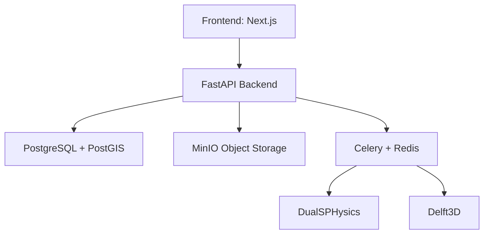

# Jaldhara

Jaldhara is a dam-break inundation modelling platform for disaster management planning. It combines geospatial data, simulation workflows, and web-based analysis to help teams assess inundation risk, model flood scenarios, and prepare response strategies.

## What it does
- Defines areas of interest for dam and breach analysis
- Runs inundation simulations using open-source hydrodynamic and particle-based engines
- Stores and processes spatial data with PostgreSQL/PostGIS and MinIO
- Exposes API and dashboard workflows for monitoring, export, and impact review

## Architecture



## Tech stack
- Frontend: Next.js, TypeScript, Tailwind CSS
- Backend: Python, FastAPI, SQLAlchemy
- Database: PostgreSQL with PostGIS
- Queuing: Redis + Celery
- Storage: MinIO
- Authentication: Keycloak
- Simulation engines: DualSPHysics, Delft3D

## Quick start
1. Copy the environment file if present for your setup.
2. Start the stack:
   ```bash
   docker-compose up -d
   ```
3. Open the app in the browser:
   - Frontend: http://localhost:3000
   - API docs: http://localhost:8000/docs

## Documentation
- [docs/API.md](docs/API.md)
- [docs/ARCHITECTURE.md](docs/ARCHITECTURE.md)
- [docs/DEPLOYMENT.md](docs/DEPLOYMENT.md)
- [docs/SIMULATION_ENGINES.md](docs/SIMULATION_ENGINES.md)

## License
MIT
