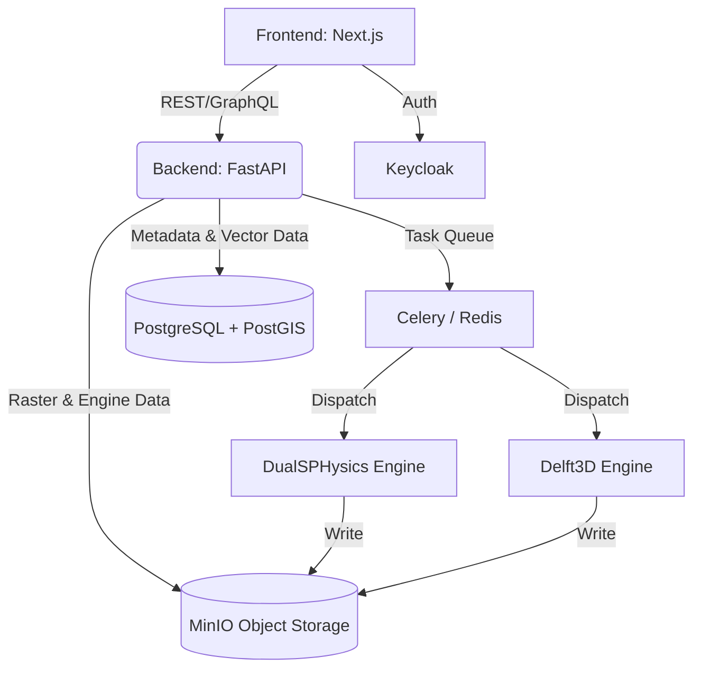

# Jaldhara — Dam Break Inundation Modelling System

## Problem Statement
**SIH26161 (NTRO, Disaster Management)**
Dam Break Inundation Modelling System

## Description
Jaldhara is a comprehensive, production-grade system for modelling dam break inundation scenarios. It integrates high-resolution DEMs, hydrological data, and state-of-the-art simulation engines (DualSPHysics, Delft3D) to provide rapid, accurate, and actionable inundation maps for disaster management authorities (DDMAs).

## Architecture

## Tech Stack
- **Frontend**: Next.js (React), TypeScript, Tailwind CSS, Mapbox/DeckGL
- **Backend**: Python, FastAPI, SQLAlchemy, GeoPandas, Rasterio
- **Database**: PostgreSQL with PostGIS
- **Cache/Queue**: Redis + Celery
- **Object Storage**: MinIO (S3-compatible)
- **Authentication**: Keycloak
- **Simulation Engines**: DualSPHysics, Delft3D D-Flow FM

## Quick Start
1. Copy environment variables: `cp .env.example .env`
2. Start the stack: `docker-compose up -d`
3. The frontend is available at `http://localhost:3000`
4. Backend API docs at `http://localhost:8000/docs`

## API Documentation
See [docs/API.md](docs/API.md) for details.

## Screenshots
*(Add screenshots here)*

## Team
*(Add team info here)*

## License
MIT License
