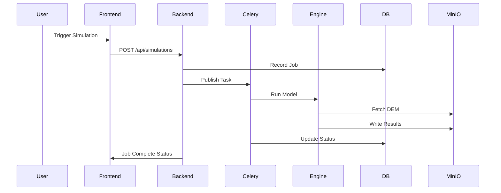

# Architecture Documentation

## System Overview
Jaldhara is a microservices-based system meant to be robust, horizontally scalable, and capable of handling intense simulation workloads (SPH and Delft3D).

## Components
1. **Next.js Frontend**: Presents dashboard, maps, and reports.
2. **FastAPI Backend**: Handles business logic, triggers jobs, and interfaces with the DB.
3. **Celery Queue**: Dispatches simulation jobs async.
4. **PostGIS**: Stores relational and geospatial data.
5. **MinIO**: Stores large files (DEMs, output grids).
6. **Simulation Engines**: Containerized runtimes for models.

## Data Flow

## Production Considerations
- **MeghRaj Cloud**: Can be deployed on MeghRaj to ensure data sovereignty.
- **Auto-scaling**: SPH/Delft3D worker nodes should autoscale based on Celery queue length.
